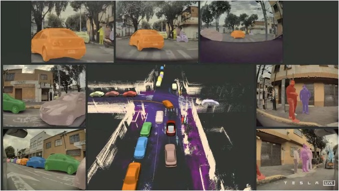
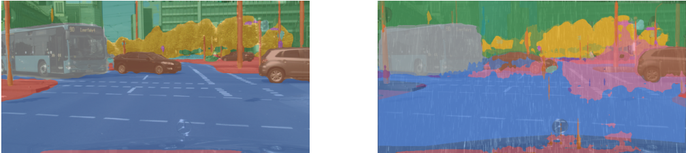
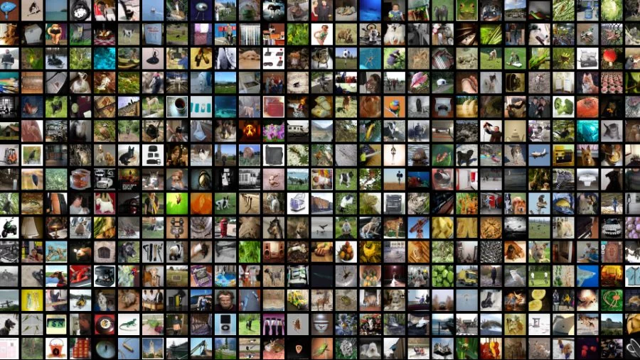

::: block
## Online Unsupervised Domain Adaptation

What is it and our research so far
::: 

---

<!-- .slide: data-background="rgb(52, 53, 48)" -->
### We have reached a state of superhuman perception

::: {.container}
:::: {.col}

::::
:::

---

<!-- .slide: data-background="rgb(52, 53, 48)" -->

### But when the unexpected happens

---

### How do we solve this?

1. **Domain Generalization**: Building models to work across varied domains.

2. **Domain Adaptation**: Focus on the Target Domain (deployment)

---

### Domain Generalization is Scale

---

### Problems

1. Costly
2. Is it even posible?
3. Performance vs Complexity

---

### Unsupervised Domain Adaptation (UDA)

**Perform well only in the Domain that matters!** {.fragment .fade-in-then-out}

**Unsupervised: No labels** {.fragment .fade-in}

---

### The two Eras

* Old Find the common information between labeled (Source) and deployment (Target) Domain

* Now Train on the Target reguralized on Source

---

### GTA &rarr; CityScapes

::: container
:::: column

::::
:::: column

<canvas class="stretch" data-chart="bar" width="400" height="300">
<!--
{ "options": {
        "scales": {
            "y": {
                "beginAtZero": true,
                "title": {
                    "display": true,
                    "text": "mIoU"
                }
            }
        }
    }
}
-->
,GTA &rarr; CityScapes
CyCADA (2018), 39.5
ILM-ASSL (2023), 76.1
Oracle (Segformer), 82.4
</canvas>

::::
:::

---

### History of UDA

Create a domain agnostic feature representation {style="color: #EED971"}

Domain-Adversarial Training of Neural Networks, Ganin et al 2016. {style="font-size:30px"}

---

### Improvements

* Per class discriminators (Chen et al)
* Move the discriminator to the prediction
* Use multiple discriminators (Tsai et al)
* Use the entropy of the prediction instead (Advent)

---

### New SoTAs: DaFormer

 {style="width: 80%"}

Self-Train on target:

* Avoid Collapse through Source Loss
* Avoid Overfitting to Source with Dist loss

---

### DACS: An easy trick that works

Take objects from the Source Image and put them into the target sample. Train using those ground truths.

---

### Online UDA

Can we adapt to new domains as they appear? 

Why?

Environment changes **unpredictably**, do we have it in our dataset?  {.fragment .fade-in}

---

### Online UDA experiment

* Synthetic rain
* Move steadily from low to high rain

---

<!-- .slide: data-background="rgb(0, 0, 0)" -->
### 🌊  Onda - ECCV22

<video loop muted autoplay controls>
  <source src="200m_demo.mp4" type="video/mp4">
</video>

---

### Challenges

* Catastrophic forgetting
* Speed of Adapting
* Self-Training confidence not calibrated

---

<!-- .slide: style="text-align: left;" -->
# THE END 

Whats next? 

How can we make it real-time?
